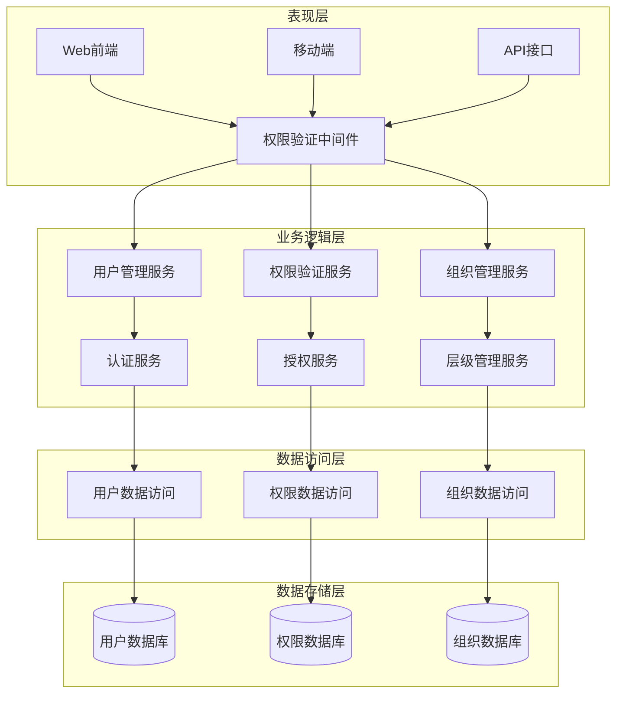
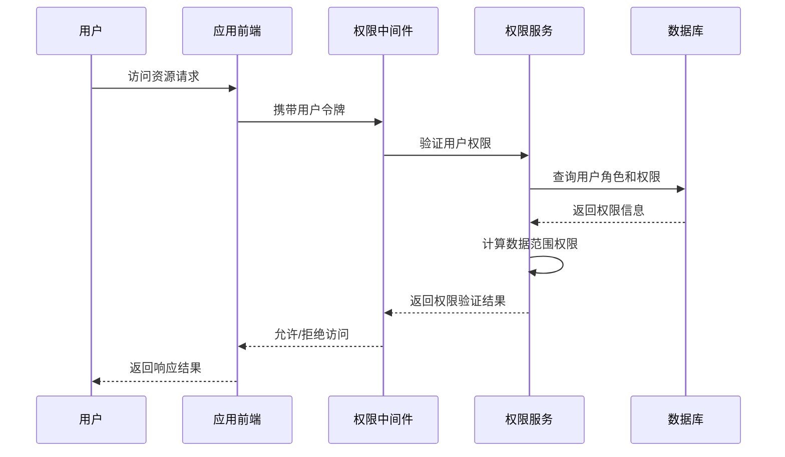
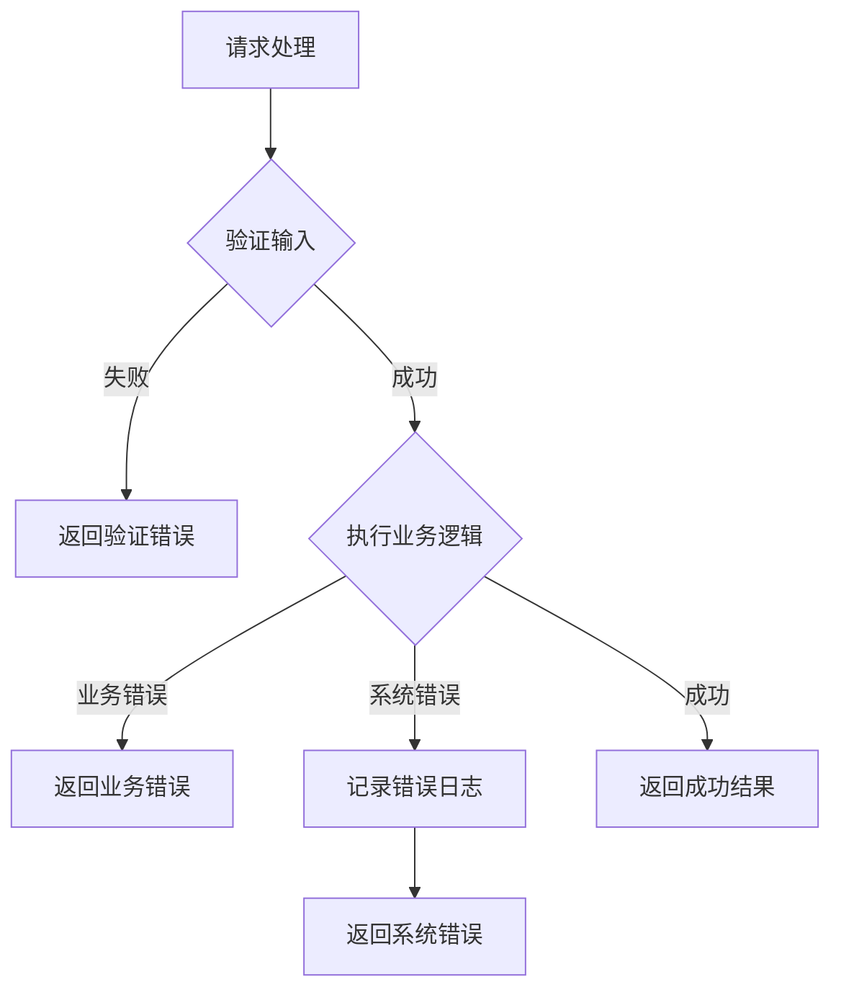

# 企业权限管理系统设计文档

## Overview

企业权限管理系统采用基于角色的访问控制（RBAC）模型，结合层级组织架构和数据范围权限控制，为大型企业集团提供统一的权限管理解决方案。系统支持多公司、多部门的复杂组织结构，实现细粒度的功能权限和数据权限控制。

核心设计理念：
- **层级化权限继承**：基于组织架构的权限继承机制
- **多租户隔离**：支持多公司独立权限管理
- **细粒度控制**：从菜单到按钮级别的功能权限控制
- **数据范围权限**：基于部门层级的数据访问控制
- **可扩展架构**：支持灵活的权限模型扩展

## Architecture

### 系统架构图



### 权限验证流程



## Components and Interfaces

### 核心组件设计

#### 1. 用户管理组件 (UserManager)

**职责：** 管理用户生命周期、身份验证和基本信息维护

**接口定义：**
```typescript
interface UserManager {
  createUser(userData: UserCreateRequest): Promise<User>
  authenticateUser(credentials: LoginCredentials): Promise<AuthResult>
  updateUserStatus(userId: string, status: UserStatus): Promise<void>
  getUserProfile(userId: string): Promise<UserProfile>
  recordLoginActivity(userId: string, loginInfo: LoginInfo): Promise<void>
}
```

#### 2. 权限验证组件 (PermissionValidator)

**职责：** 执行权限验证逻辑，包括功能权限和数据权限验证

**接口定义：**
```typescript
interface PermissionValidator {
  hasMenuPermission(userId: string, menuCode: string): Promise<boolean>
  hasDataPermission(userId: string, dataScope: DataScope, resourceId: string): Promise<boolean>
  getUserPermissions(userId: string, companyPath: string): Promise<UserPermissions>
  validateOperation(userId: string, operation: Operation): Promise<ValidationResult>
}
```

#### 3. 组织管理组件 (OrganizationManager)

**职责：** 管理公司、部门层级结构和组织关系

**接口定义：**
```typescript
interface OrganizationManager {
  createCompany(companyData: CompanyCreateRequest): Promise<Company>
  buildCompanyHierarchy(companyId: string): Promise<CompanyHierarchy>
  createDepartment(deptData: DepartmentCreateRequest): Promise<Department>
  getDepartmentHierarchy(deptId: string): Promise<DepartmentHierarchy>
  assignUserToDepartment(userId: string, deptId: string): Promise<void>
}
```

#### 4. 角色管理组件 (RoleManager)

**职责：** 管理角色定义、权限分配和角色关系

**接口定义：**
```typescript
interface RoleManager {
  createRole(roleData: RoleCreateRequest): Promise<Role>
  assignRoleToUser(userId: string, roleId: string, companyId: string): Promise<void>
  configureDataScope(roleId: string, dataScope: DataScopeConfig): Promise<void>
  getRolePermissions(roleId: string): Promise<RolePermissions>
}
```

### 数据传输对象 (DTOs)

```typescript
interface UserCreateRequest {
  code: string
  name: string
  email: string
  phoneNumber: string
  userType: UserType
  companyId: string
  departmentId: string
}

interface AuthResult {
  success: boolean
  token?: string
  user?: UserProfile
  permissions?: UserPermissions
}

interface DataScopeConfig {
  scope: DataScopeType
  departmentIds?: string[]
  companyPath?: string
}
```

## Data Models

### 核心数据模型

#### 用户模型 (User)
```typescript
interface User {
  id: string
  code: string
  name: string
  email: string
  phoneNumber: string
  userType: UserType
  status: UserStatus
  avatar?: string
  loginInfo: LoginInfo
  auditInfo: AuditInfo
}
```

#### 公司模型 (Company)
```typescript
interface Company {
  id: string
  code: string
  name: string
  shortName?: string
  path: string // 层级路径，如 "001.001001.001001001"
  parentId?: string
  status: CompanyStatus
  contactInfo: ContactInfo
  auditInfo: AuditInfo
}
```

#### 角色模型 (Role)
```typescript
interface Role {
  id: string
  code: string
  name: string
  roleKey: string
  dataScope: DataScopeType
  status: RoleStatus
  companyPath: string
  menuPermissions: MenuPermission[]
  departmentPermissions: DepartmentPermission[]
  auditInfo: AuditInfo
}
```

#### 菜单模型 (Menu)
```typescript
interface Menu {
  id: string
  code: string
  name: string
  parentId?: string
  menuType: MenuType
  path?: string
  component?: string
  permissions: string
  icon?: string
  orderNum: number
  status: MenuStatus
  auditInfo: AuditInfo
}
```

### 枚举类型定义

```typescript
enum UserType {
  SYSTEM_USER = '0',
  ADMINISTRATOR = '1'
}

enum UserStatus {
  ACTIVE = '0',
  DISABLED = '1'
}

enum DataScopeType {
  ALL_DATA = 1,
  CUSTOM_DATA = 2,
  DEPARTMENT_DATA = 3,
  DEPARTMENT_AND_BELOW = 4
}

enum MenuType {
  DIRECTORY = 'M',
  MENU = 'C',
  BUTTON = 'F'
}
```

## Correctness Properties

*A property is a characteristic or behavior that should hold true across all valid executions of a system-essentially, a formal statement about what the system should do. Properties serve as the bridge between human-readable specifications and machine-verifiable correctness guarantees.*

基于需求分析，以下是系统必须满足的核心正确性属性：

### Property 1: 实体创建唯一性
*For any* 系统实体（公司、用户、项目），创建操作应该生成唯一的编码标识，且不与现有实体冲突
**Validates: Requirements 1.1, 2.1, 6.1**

### Property 2: 层级关系一致性
*For any* 层级结构（公司、部门、菜单），建立父子关系后，路径信息和祖级列表应该保持一致和完整
**Validates: Requirements 1.2, 3.1, 5.2**

### Property 3: 状态变更审计性
*For any* 实体状态修改操作，系统应该更新状态并记录完整的操作审计信息
**Validates: Requirements 1.3, 2.3, 6.3, 7.1**

### Property 4: 查询信息完整性
*For any* 实体查询操作，返回的信息应该包含该实体的所有必需字段和关联信息
**Validates: Requirements 1.4, 3.3**

### Property 5: 关联关系建立性
*For any* 实体关联操作（用户-部门、用户-角色、角色-部门、项目-公司），应该正确建立双向关联关系
**Validates: Requirements 3.4, 4.3, 4.4, 6.2**

### Property 6: 用户认证安全性
*For any* 用户登录操作，系统应该验证凭据、记录登录信息，且密码应以加密形式存储
**Validates: Requirements 2.2, 2.4, 2.6**

### Property 7: 权限配置有效性
*For any* 权限配置操作（角色权限、数据范围、菜单权限），配置应该正确生效并影响用户访问控制
**Validates: Requirements 4.1, 4.2, 5.4**

### Property 8: 菜单类型支持性
*For any* 菜单创建操作，系统应该支持目录(M)、菜单(C)、按钮(F)三种类型，并正确设置相应属性
**Validates: Requirements 5.1, 5.3, 5.5, 5.6**

### Property 9: 用户类型区分性
*For any* 用户创建和管理操作，系统应该正确区分系统用户(0)和管理员(1)类型，并应用相应权限
**Validates: Requirements 2.5**

### Property 10: 数据权限过滤性
*For any* 数据访问操作，系统应该根据用户的数据范围权限正确过滤可访问的数据
**Validates: Requirements 8.4**

### Property 11: CRUD操作一致性
*For any* 实体的增删改查操作，创建后查询应该返回相同数据，修改后查询应该反映变更
**Validates: Requirements 1.5, 6.4**

### Property 12: 操作日志可追溯性
*For any* 关键操作执行后，应该能够通过日志查询功能追溯到操作的完整信息
**Validates: Requirements 7.4**

## Error Handling

### 错误分类和处理策略

#### 1. 业务逻辑错误
- **重复编码错误：** 当创建实体时编码已存在，返回具体的错误信息
- **层级关系错误：** 当设置父子关系形成循环依赖时，拒绝操作并提示
- **权限不足错误：** 当用户尝试访问超出权限范围的资源时，返回403错误
- **数据完整性错误：** 当删除被引用的实体时，提示存在关联关系

#### 2. 数据验证错误
- **必填字段验证：** 验证所有必填字段的存在性和有效性
- **数据格式验证：** 验证邮箱、手机号等字段的格式正确性
- **数据长度验证：** 验证字符串字段的长度限制
- **枚举值验证：** 验证状态、类型等枚举字段的有效性

#### 3. 系统级错误
- **数据库连接错误：** 实现连接池和重试机制
- **并发冲突错误：** 使用乐观锁处理并发更新冲突
- **资源不存在错误：** 当查询不存在的资源时，返回404错误
- **服务不可用错误：** 实现熔断器模式处理服务降级

### 错误响应格式

```typescript
interface ErrorResponse {
  code: string
  message: string
  details?: any
  timestamp: string
  path: string
}
```

### 错误处理流程



## Testing Strategy

### 测试方法论

本系统采用**双重测试策略**，结合单元测试和基于属性的测试（Property-Based Testing），确保系统的正确性和可靠性。

#### 单元测试 (Unit Testing)
**目标：** 验证具体的业务场景、边界条件和错误处理

**测试范围：**
- 具体的业务场景验证（如特定用户登录流程）
- 边界条件测试（如空输入、最大长度输入）
- 错误条件测试（如无效凭据、权限不足）
- 组件集成点测试

**测试框架：** Jest + TypeScript
**覆盖率要求：** 核心业务逻辑 > 90%

#### 基于属性的测试 (Property-Based Testing)
**目标：** 验证系统的通用正确性属性，通过大量随机输入发现边缘情况

**测试范围：**
- 验证设计文档中定义的12个核心正确性属性
- 每个属性测试运行最少100次迭代
- 使用随机数据生成器覆盖各种输入组合

**测试框架：** fast-check (JavaScript/TypeScript的属性测试库)
**配置要求：** 每个属性测试最少100次迭代

#### 测试标记格式
每个属性测试必须使用以下标记格式进行注释：
```typescript
// Feature: enterprise-permission-system, Property 1: 实体创建唯一性
```

### 测试实现策略

#### 1. 数据生成器设计
```typescript
// 智能数据生成器，约束到有效输入空间
const userGenerator = fc.record({
  code: fc.string({ minLength: 1, maxLength: 32 }),
  name: fc.string({ minLength: 1, maxLength: 90 }),
  email: fc.emailAddress(),
  userType: fc.constantFrom(UserType.SYSTEM_USER, UserType.ADMINISTRATOR)
})

const companyHierarchyGenerator = fc.array(
  fc.record({
    code: fc.string({ minLength: 1, maxLength: 32 }),
    name: fc.string({ minLength: 1, maxLength: 90 }),
    parentId: fc.option(fc.string())
  }),
  { minLength: 1, maxLength: 10 }
)
```

#### 2. 属性测试示例
```typescript
describe('Property 1: 实体创建唯一性', () => {
  it('should generate unique codes for all entities', () => {
    fc.assert(fc.property(
      fc.array(userGenerator, { minLength: 2, maxLength: 10 }),
      async (users) => {
        const createdUsers = []
        for (const userData of users) {
          const user = await userManager.createUser(userData)
          createdUsers.push(user)
        }
        
        const codes = createdUsers.map(u => u.code)
        const uniqueCodes = new Set(codes)
        
        // 验证所有编码都是唯一的
        expect(codes.length).toBe(uniqueCodes.size)
      }
    ), { numRuns: 100 })
  })
})
```

#### 3. 集成测试策略
- **API层测试：** 测试完整的HTTP请求-响应流程
- **数据库集成测试：** 使用测试数据库验证数据持久化
- **权限集成测试：** 验证端到端的权限验证流程

### 测试环境配置

#### 测试数据库
- 使用独立的测试数据库实例
- 每个测试用例前后进行数据清理
- 使用事务回滚确保测试隔离

#### Mock策略
- 最小化Mock使用，优先使用真实实现
- 仅对外部依赖（如邮件服务、短信服务）使用Mock
- 避免对核心业务逻辑使用Mock

### 性能测试

#### 负载测试
- 模拟1000并发用户的权限验证请求
- 验证系统在高负载下的响应时间和稳定性

#### 压力测试
- 测试系统的极限承载能力
- 验证系统在资源不足时的降级策略

### 安全测试

#### 权限测试
- 验证用户只能访问授权范围内的数据
- 测试权限提升攻击的防护
- 验证数据范围权限的正确实施

#### 输入验证测试
- SQL注入攻击防护测试
- XSS攻击防护测试
- 输入长度和格式验证测试

### 测试自动化

#### CI/CD集成
- 所有测试在代码提交时自动运行
- 测试失败时阻止代码合并
- 生成测试覆盖率报告

#### 测试报告
- 生成详细的测试执行报告
- 包含属性测试的反例信息
- 提供性能测试的基准对比