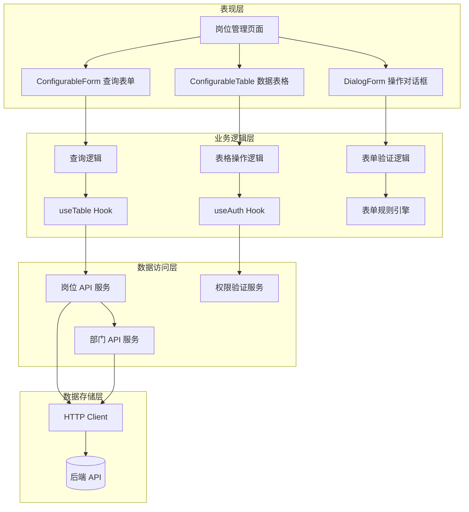
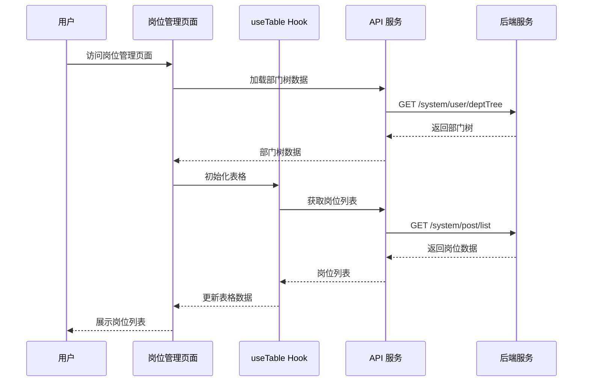
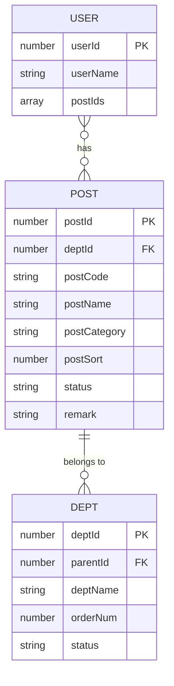
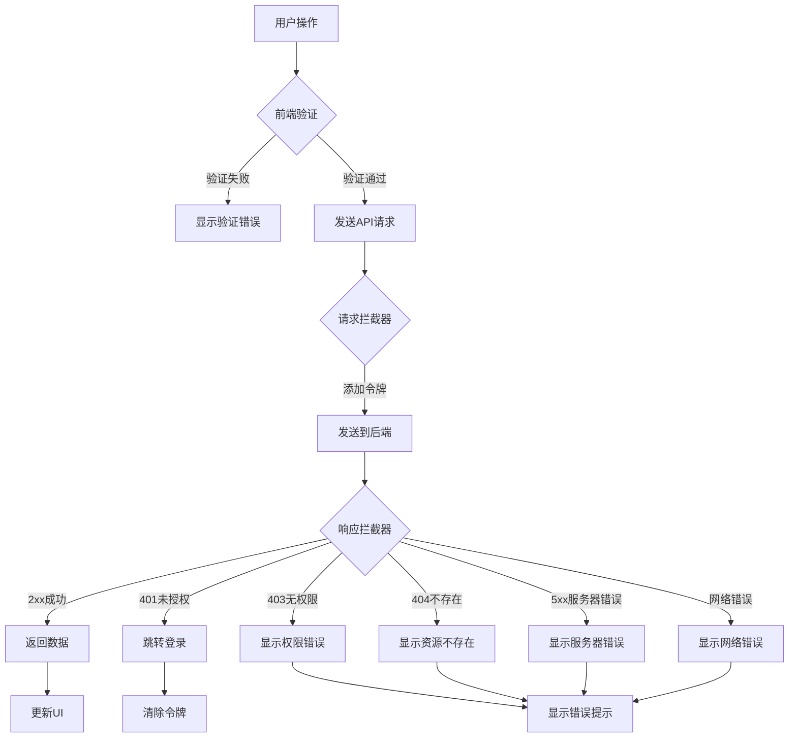

# 岗位管理设计文档

## 概述

岗位管理模块是企业组织架构管理的核心组成部分，提供岗位信息的全生命周期管理功能。该模块采用 Vue 3 + TypeScript + Element Plus 技术栈，基于可配置组件架构设计，实现了高度可复用和可维护的前端解决方案。

核心设计理念：
- **组件化架构**：基于 ConfigurableForm、ConfigurableTable、DialogForm 等可配置组件构建
- **类型安全**：完整的 TypeScript 类型定义，确保编译时类型检查
- **权限控制**：细粒度的功能权限控制，基于 RBAC 模型
- **部门联动**：与部门管理模块深度集成，支持部门树选择和筛选
- **用户体验**：响应式设计、加载状态、错误提示、二次确认等完善的交互体验

## 架构设计

### 系统架构图



### 数据流程图




## 组件和接口

### 核心组件设计

#### 1. 岗位管理页面组件 (PostManagement)

**职责：** 岗位管理的主页面，协调查询、表格、对话框等子组件

**组件结构：**
```vue
<template>
  <div class="page-container">
    <el-card class="query-card">
      <ConfigurableForm /> <!-- 查询表单 -->
    </el-card>
    <el-card class="table-card">
      <ConfigurableTable /> <!-- 数据表格 -->
    </el-card>
    <DialogForm /> <!-- 操作对话框 -->
  </div>
</template>
```

**状态管理：**
```typescript
interface PostManagementState {
  // 查询表单
  queryForm: PostSearchParams
  
  // 表格数据
  tableData: Post[]
  total: number
  pageNum: number
  pageSize: number
  selectedRows: Post[]
  
  // 对话框
  dialogVisible: boolean
  dialogType: 'add' | 'edit'
  dialogForm: Partial<PostOperateParams>
  dialogLoading: boolean
  
  // 部门树
  deptTreeData: DeptTree[]
}
```

#### 2. 可配置查询表单 (ConfigurableForm)

**职责：** 提供灵活的查询表单配置，支持多种表单控件

**配置接口：**
```typescript
interface FormFieldConfig {
  prop: string                    // 字段属性名
  label: string                   // 字段标签
  component: FieldComponentType   // 组件类型
  placeholder?: string            // 占位符
  options?: Array<{               // 选项（select、radio等）
    label: string
    value: string | number
  }>
  span?: number                   // 栅格占位
  // 树形选择器特有属性
  data?: any[]                    // 树形数据
  props?: {                       // 树形节点配置
    label: string
    value: string
  }
  checkStrictly?: boolean         // 是否严格模式
}
```

#### 3. 可配置数据表格 (ConfigurableTable)

**职责：** 提供灵活的表格配置，支持工具栏、操作列、分页等

**配置接口：**
```typescript
interface TableColumnConfig {
  prop: string                    // 列属性名
  label: string                   // 列标题
  align?: 'left' | 'center' | 'right'
  width?: number | string
  showOverflowTooltip?: boolean
  formatter?: (row: any) => string
  cellSlot?: string               // 自定义插槽名
  buttons?: ButtonConfig[]        // 操作按钮配置
}

interface ButtonConfig {
  label: string
  type?: 'primary' | 'success' | 'warning' | 'danger'
  icon?: Component
  link?: boolean
  visible?: () => boolean
  disabled?: () => boolean
  click: (scope: any) => void
}

interface ToolbarConfig {
  label: string
  type?: 'primary' | 'success' | 'warning' | 'danger'
  icon?: Component
  disabled?: () => boolean
  click: () => void
}
```

#### 4. 对话框表单 (DialogForm)

**职责：** 提供统一的对话框表单组件，支持分段表单和验证

**配置接口：**
```typescript
interface DialogSection {
  type: 'form'
  key: string
  title: string
  fields: FormFieldConfig[]
}

interface DialogFormProps {
  modelValue: boolean             // 对话框可见性
  formData: any                   // 表单数据
  title: string                   // 对话框标题
  sections: DialogSection[]       // 表单分段配置
  rules: FormRules                // 验证规则
  confirmLoading: boolean         // 确认按钮加载状态
}
```

### API 接口定义

#### 岗位管理 API

```typescript
/**
 * 获取岗位列表
 */
function fetchGetPostList(params: PostSearchParams): Promise<PageResponse<Post>>

/**
 * 获取岗位详情
 */
function fetchGetPostDetail(postId: number): Promise<Post>

/**
 * 新增岗位
 */
function fetchCreatePost(data: PostOperateParams): Promise<void>

/**
 * 更新岗位
 */
function fetchUpdatePost(data: PostOperateParams): Promise<void>

/**
 * 删除岗位
 */
function fetchDeletePost(postId: number): Promise<void>

/**
 * 批量删除岗位
 */
function fetchBatchDeletePost(postIds: number[]): Promise<void>

/**
 * 导出岗位
 */
function fetchExportPost(params: PostSearchParams): Promise<Blob>
```

#### 部门管理 API

```typescript
/**
 * 获取部门树
 */
function fetchGetDeptTree(): Promise<DeptTree[]>
```

### Hooks 设计

#### useTable Hook

**职责：** 封装表格数据管理逻辑，包括查询、分页、刷新等

```typescript
interface UseTableOptions {
  getTableData: (params: any) => Promise<{
    dataList: any[]
    totalCount: number
  }>
  immediate?: boolean
}

interface UseTableReturn {
  queryForm: Ref<any>
  data: Ref<any[]>
  total: Ref<number>
  pageNum: Ref<number>
  pageSize: Ref<number>
  onQuery: () => void
  onReset: () => void
  onCurrentChange: (page: number) => void
  onSizeChange: (size: number) => void
  refresh: () => void
}

function useTable(options: UseTableOptions): UseTableReturn
```

#### useAuth Hook

**职责：** 封装权限验证逻辑

```typescript
interface UseAuthReturn {
  hasAuth: ComputedRef<(permission: string) => boolean>
}

function useAuth(): UseAuthReturn
```


## 数据模型

### 核心数据模型

#### 岗位实体 (Post)

```typescript
interface Post {
  postId: number              // 岗位ID
  tenantId?: number           // 租户编号
  deptId?: number             // 部门ID
  deptName?: string           // 部门名称（关联查询）
  postCode: string            // 岗位编码
  postCategory?: string       // 类别编码
  postName: string            // 岗位名称
  postSort: number            // 显示顺序
  status: '0' | '1'           // 状态（0:正常 1:停用）
  remark?: string             // 备注
  createTime?: string         // 创建时间
  updateTime?: string         // 更新时间
}
```

#### 岗位搜索参数 (PostSearchParams)

```typescript
interface PostSearchParams extends PageQuery {
  postCode?: string           // 岗位编码（模糊搜索）
  postName?: string           // 岗位名称（模糊搜索）
  status?: '0' | '1'          // 状态（精确匹配）
  deptId?: number             // 归属部门ID（精确匹配）
}

interface PageQuery {
  pageNum?: number            // 页码（默认1）
  pageSize?: number           // 每页数量（默认10）
}
```

#### 岗位操作参数 (PostOperateParams)

```typescript
interface PostOperateParams {
  postId?: number             // 岗位ID（编辑时必填）
  deptId?: number             // 部门ID
  postCode: string            // 岗位编码（必填，2-64字符）
  postCategory?: string       // 类别编码
  postName: string            // 岗位名称（必填，2-50字符）
  postSort: number            // 显示顺序（必填，非负整数）
  status: '0' | '1'           // 状态（必填）
  remark?: string             // 备注
}
```

#### 部门树节点 (DeptTree)

```typescript
interface DeptTree {
  id: number                  // 部门ID
  label: string               // 部门名称
  children?: DeptTree[]       // 子部门
}
```

#### 分页响应 (PageResponse)

```typescript
interface PageResponse<T> {
  rows: T[]                   // 数据列表
  total: number               // 总记录数
}
```

### 枚举类型定义

```typescript
/**
 * 岗位状态
 */
enum PostStatus {
  NORMAL = '0',               // 正常
  DISABLED = '1'              // 停用
}

/**
 * 字段组件类型
 */
type FieldComponentType = 
  | 'input'                   // 输入框
  | 'input-number'            // 数字输入框
  | 'select'                  // 下拉选择
  | 'radio-group'             // 单选组
  | 'el-tree-select'          // 树形选择器

/**
 * 按钮类型
 */
type ButtonType = 
  | 'primary' 
  | 'success' 
  | 'warning' 
  | 'danger'
```

### 表单验证规则

```typescript
interface FormRules {
  [key: string]: FormRule[]
}

interface FormRule {
  required?: boolean          // 是否必填
  message?: string            // 错误提示
  trigger?: string | string[] // 触发方式
  type?: string               // 数据类型
  min?: number                // 最小长度/值
  max?: number                // 最大长度/值
  pattern?: RegExp            // 正则表达式
  validator?: (rule: any, value: any, callback: any) => void
}
```

### 数据关系图




## 正确性属性

*属性是系统在所有有效执行中都应该保持为真的特征或行为——本质上是关于系统应该做什么的形式化陈述。属性是人类可读规范和机器可验证正确性保证之间的桥梁。*

基于需求分析和prework分析，以下是系统必须满足的核心正确性属性：

### Property 1: 岗位列表字段完整性
*For any* 岗位列表渲染操作，返回的每个岗位对象都应该包含岗位编码、类别编码、岗位名称、显示顺序、状态和创建时间字段
**Validates: Requirements 1.1**

### Property 2: 分页参数正确性
*For any* 分页查询操作，当数据总量超过单页容量时，传递的分页参数（pageNum、pageSize）应该正确反映在API请求中，且返回的数据量不超过pageSize
**Validates: Requirements 1.2**

### Property 3: 状态字典翻译一致性
*For any* 岗位状态值（'0' 或 '1'），通过字典翻译后应该分别对应"正常"和"停用"标签
**Validates: Requirements 1.3**

### Property 4: 搜索结果匹配性
*For any* 搜索操作（按岗位编码、岗位名称或状态），返回的所有结果都应该匹配搜索条件（编码和名称支持模糊匹配，状态精确匹配）
**Validates: Requirements 2.1, 2.2, 2.3**

### Property 5: 部门筛选正确性
*For any* 部门筛选操作，返回的所有岗位的deptId应该等于选中的部门ID或其子部门ID
**Validates: Requirements 2.6, 12.3**

### Property 6: 岗位创建持久性
*For any* 有效的岗位数据，创建操作成功后，通过岗位ID查询应该返回相同的岗位信息
**Validates: Requirements 3.5**

### Property 7: 岗位更新生效性
*For any* 岗位更新操作，更新成功后查询该岗位应该反映所有修改的字段值
**Validates: Requirements 4.1, 4.3**

### Property 8: 岗位删除完整性
*For any* 岗位删除操作（单条或批量），删除成功后查询岗位列表不应该包含已删除的岗位
**Validates: Requirements 5.3**

### Property 9: 表单验证拦截性
*For any* 表单提交操作，当必填字段（postCode、postName、postSort、status）为空时，验证应该失败并阻止提交
**Validates: Requirements 6.1, 6.2, 6.3, 6.4, 6.5**

### Property 10: 导出参数传递性
*For any* 导出操作，导出请求应该携带当前的所有搜索条件参数
**Validates: Requirements 7.1**

### Property 11: 权限控制可见性
*For any* 功能按钮（新增、编辑、删除、导出），当用户没有对应权限时，按钮应该被隐藏或禁用
**Validates: Requirements 8.1, 8.2, 8.3, 8.4**

### Property 12: 权限验证拦截性
*For any* 需要权限的操作，当用户没有对应权限时，系统应该拦截操作并显示权限不足提示
**Validates: Requirements 8.5**

### Property 13: 类型定义完整性
*For any* 岗位相关的数据传输，TypeScript类型定义应该包含所有必需字段，且字段类型与后端API保持一致
**Validates: Requirements 9.1, 9.2, 9.3, 9.4**

### Property 14: 部门树数据完整性
*For any* 部门树加载操作，返回的部门树应该包含所有部门节点，且保持正确的父子层级关系
**Validates: Requirements 12.1, 12.5**

### Property 15: 部门删除级联处理性
*For any* 部门删除操作，如果该部门下存在岗位，系统应该提示用户重新分配岗位或执行级联删除
**Validates: Requirements 12.4**


## 错误处理

### 错误分类和处理策略

#### 1. 业务逻辑错误

**重复编码错误**
- **场景：** 创建岗位时，岗位编码已存在
- **处理：** 返回具体的错误信息"岗位编码已存在"，阻止创建操作
- **用户反馈：** 显示错误提示消息，保持表单数据不丢失

**关联数据错误**
- **场景：** 删除岗位时，该岗位已被用户关联
- **处理：** 返回错误信息"该岗位已被用户使用，无法删除"
- **用户反馈：** 显示错误提示，建议先解除用户关联

**部门不存在错误**
- **场景：** 创建或编辑岗位时，选择的部门不存在
- **处理：** 返回错误信息"所选部门不存在"
- **用户反馈：** 显示错误提示，要求重新选择部门

#### 2. 数据验证错误

**必填字段验证**
- **验证规则：**
  - 岗位编码：必填，2-64字符
  - 岗位名称：必填，2-50字符
  - 显示顺序：必填，非负整数
  - 状态：必填，'0' 或 '1'
- **处理：** 前端实时验证，显示具体的错误提示
- **触发时机：** 输入时（input）和失焦时（blur）

**数据格式验证**
- **验证规则：**
  - 显示顺序：必须为数字类型
  - 状态：必须为枚举值 '0' 或 '1'
- **处理：** 类型检查，显示格式错误提示

**数据长度验证**
- **验证规则：**
  - 岗位编码：2-64字符
  - 岗位名称：2-50字符
  - 备注：最大500字符
- **处理：** 长度检查，显示长度限制提示

#### 3. 权限错误

**无权限访问**
- **场景：** 用户尝试访问无权限的功能
- **处理：** 前端隐藏按钮，后端返回403错误
- **用户反馈：** 显示"权限不足"提示

**会话过期**
- **场景：** 用户令牌过期
- **处理：** 拦截器捕获401错误，清除本地令牌
- **用户反馈：** 跳转到登录页面，提示"登录已过期，请重新登录"

#### 4. 网络和系统错误

**网络连接错误**
- **场景：** 网络断开或请求超时
- **处理：** 请求拦截器捕获网络错误
- **用户反馈：** 显示"网络连接失败，请检查网络"

**服务器错误**
- **场景：** 后端服务异常（500错误）
- **处理：** 响应拦截器捕获5xx错误
- **用户反馈：** 显示"服务器错误，请稍后重试"

**资源不存在**
- **场景：** 查询不存在的岗位
- **处理：** 返回404错误
- **用户反馈：** 显示"岗位不存在或已被删除"

### 错误响应格式

```typescript
interface ErrorResponse {
  code: number                // 错误码
  message: string             // 错误消息
  data?: any                  // 附加数据
  timestamp: string           // 时间戳
}
```

### 错误处理流程



### 错误处理最佳实践

#### 1. 统一错误拦截
```typescript
// 响应拦截器
httpClient.interceptors.response.use(
  (response) => response.data,
  (error) => {
    const { response } = error
    
    if (!response) {
      ElMessage.error('网络连接失败，请检查网络')
      return Promise.reject(error)
    }
    
    switch (response.status) {
      case 401:
        // 清除令牌，跳转登录
        authStore.clearToken()
        router.push('/login')
        break
      case 403:
        ElMessage.error('权限不足')
        break
      case 404:
        ElMessage.error('资源不存在')
        break
      case 500:
        ElMessage.error('服务器错误，请稍后重试')
        break
      default:
        ElMessage.error(response.data?.message || '操作失败')
    }
    
    return Promise.reject(error)
  }
)
```

#### 2. 业务错误处理
```typescript
async function handleCreate() {
  try {
    await fetchCreatePost(formData.value)
    ElMessage.success('新增成功')
    dialogVisible.value = false
    refresh()
  } catch (error) {
    // 错误已在拦截器中处理，这里只需记录日志
    console.error('创建岗位失败:', error)
  }
}
```

#### 3. 表单验证错误
```typescript
const rules: FormRules = {
  postCode: [
    { required: true, message: '请输入岗位编码', trigger: 'blur' },
    { min: 2, max: 64, message: '长度在 2 到 64 个字符', trigger: 'blur' }
  ],
  postName: [
    { required: true, message: '请输入岗位名称', trigger: 'blur' },
    { min: 2, max: 50, message: '长度在 2 到 50 个字符', trigger: 'blur' }
  ]
}
```


## 测试策略

### 测试方法论

本系统采用**双重测试策略**，结合单元测试和基于属性的测试（Property-Based Testing），确保系统的正确性和可靠性。

#### 单元测试 (Unit Testing)

**目标：** 验证具体的业务场景、边界条件和错误处理

**测试范围：**
- 具体的业务场景验证（如特定岗位的创建、编辑、删除流程）
- 边界条件测试（如空列表、单条数据、大量数据）
- 错误条件测试（如无效输入、网络错误、权限不足）
- 组件集成点测试（如表单提交、对话框交互）
- UI交互测试（如按钮点击、对话框打开关闭）

**测试框架：** Vitest + Vue Test Utils
**覆盖率要求：** 核心业务逻辑 > 85%

**单元测试示例：**
```typescript
describe('岗位管理 - 单元测试', () => {
  it('应该在点击新增按钮时打开对话框', async () => {
    const wrapper = mount(PostManagement)
    await wrapper.find('[data-test="add-button"]').trigger('click')
    expect(wrapper.vm.dialogVisible).toBe(true)
    expect(wrapper.vm.dialogType).toBe('add')
  })
  
  it('应该在岗位编码为空时显示验证错误', async () => {
    const wrapper = mount(PostManagement)
    wrapper.vm.dialogForm.postCode = ''
    await wrapper.vm.handleDialogConfirm()
    expect(wrapper.find('.el-form-item__error').text()).toContain('岗位编码不能为空')
  })
  
  it('应该在没有选中岗位时禁用批量删除按钮', () => {
    const wrapper = mount(PostManagement)
    wrapper.vm.selectedRows = []
    expect(wrapper.find('[data-test="batch-delete-button"]').attributes('disabled')).toBeDefined()
  })
})
```

#### 基于属性的测试 (Property-Based Testing)

**目标：** 验证系统的通用正确性属性，通过大量随机输入发现边缘情况

**测试范围：**
- 验证设计文档中定义的16个核心正确性属性
- 每个属性测试运行最少100次迭代
- 使用随机数据生成器覆盖各种输入组合

**测试框架：** fast-check (JavaScript/TypeScript的属性测试库)
**配置要求：** 每个属性测试最少100次迭代

**测试标记格式：**
每个属性测试必须使用以下标记格式进行注释：
```typescript
// Feature: post-management, Property 1: 岗位列表字段完整性
```

### 测试实现策略

#### 1. 数据生成器设计

```typescript
import * as fc from 'fast-check'

// 岗位状态生成器
const postStatusArb = fc.constantFrom('0', '1')

// 岗位编码生成器（2-64字符）
const postCodeArb = fc.string({ minLength: 2, maxLength: 64 })

// 岗位名称生成器（2-50字符）
const postNameArb = fc.string({ minLength: 2, maxLength: 50 })

// 显示顺序生成器（非负整数）
const postSortArb = fc.nat({ max: 9999 })

// 岗位数据生成器
const postArb = fc.record({
  postId: fc.nat(),
  deptId: fc.option(fc.nat()),
  postCode: postCodeArb,
  postCategory: fc.option(fc.string({ maxLength: 64 })),
  postName: postNameArb,
  postSort: postSortArb,
  status: postStatusArb,
  remark: fc.option(fc.string({ maxLength: 500 }))
})

// 岗位列表生成器
const postListArb = fc.array(postArb, { minLength: 0, maxLength: 100 })

// 搜索参数生成器
const searchParamsArb = fc.record({
  postCode: fc.option(fc.string({ maxLength: 64 })),
  postName: fc.option(fc.string({ maxLength: 50 })),
  status: fc.option(postStatusArb),
  deptId: fc.option(fc.nat()),
  pageNum: fc.nat({ min: 1, max: 100 }),
  pageSize: fc.nat({ min: 10, max: 100 })
})

// 部门树生成器
const deptTreeArb: fc.Arbitrary<DeptTree> = fc.letrec(tie => ({
  deptTree: fc.record({
    id: fc.nat(),
    label: fc.string({ minLength: 1, maxLength: 50 }),
    children: fc.option(fc.array(tie('deptTree'), { maxLength: 5 }))
  })
})).deptTree
```

#### 2. 属性测试示例

```typescript
import { describe, it } from 'vitest'
import * as fc from 'fast-check'

describe('岗位管理 - 属性测试', () => {
  // Feature: post-management, Property 1: 岗位列表字段完整性
  it('Property 1: 岗位列表中的每个岗位都应该包含所有必需字段', () => {
    fc.assert(
      fc.asyncProperty(postListArb, async (posts) => {
        // 模拟渲染岗位列表
        const renderedPosts = await renderPostList(posts)
        
        // 验证每个岗位都包含必需字段
        for (const post of renderedPosts) {
          expect(post).toHaveProperty('postCode')
          expect(post).toHaveProperty('postCategory')
          expect(post).toHaveProperty('postName')
          expect(post).toHaveProperty('postSort')
          expect(post).toHaveProperty('status')
          expect(post).toHaveProperty('createTime')
        }
      }),
      { numRuns: 100 }
    )
  })
  
  // Feature: post-management, Property 4: 搜索结果匹配性
  it('Property 4: 搜索结果应该匹配搜索条件', () => {
    fc.assert(
      fc.asyncProperty(
        postListArb,
        searchParamsArb,
        async (allPosts, searchParams) => {
          // 执行搜索
          const results = await searchPosts(allPosts, searchParams)
          
          // 验证结果匹配搜索条件
          for (const post of results) {
            // 岗位编码模糊匹配
            if (searchParams.postCode) {
              expect(post.postCode).toContain(searchParams.postCode)
            }
            
            // 岗位名称模糊匹配
            if (searchParams.postName) {
              expect(post.postName).toContain(searchParams.postName)
            }
            
            // 状态精确匹配
            if (searchParams.status) {
              expect(post.status).toBe(searchParams.status)
            }
            
            // 部门ID精确匹配
            if (searchParams.deptId) {
              expect(post.deptId).toBe(searchParams.deptId)
            }
          }
        }
      ),
      { numRuns: 100 }
    )
  })
  
  // Feature: post-management, Property 6: 岗位创建持久性
  it('Property 6: 创建岗位后查询应该返回相同的数据', () => {
    fc.assert(
      fc.asyncProperty(postArb, async (postData) => {
        // 创建岗位
        const createdPost = await createPost(postData)
        
        // 查询岗位
        const queriedPost = await getPostById(createdPost.postId)
        
        // 验证数据一致性
        expect(queriedPost.postCode).toBe(postData.postCode)
        expect(queriedPost.postName).toBe(postData.postName)
        expect(queriedPost.postSort).toBe(postData.postSort)
        expect(queriedPost.status).toBe(postData.status)
      }),
      { numRuns: 100 }
    )
  })
  
  // Feature: post-management, Property 9: 表单验证拦截性
  it('Property 9: 必填字段为空时应该阻止提交', () => {
    fc.assert(
      fc.property(
        fc.record({
          postCode: fc.constantFrom('', undefined, null),
          postName: postNameArb,
          postSort: postSortArb,
          status: postStatusArb
        }),
        (invalidData) => {
          const validationResult = validatePostForm(invalidData)
          expect(validationResult.valid).toBe(false)
          expect(validationResult.errors).toContain('岗位编码不能为空')
        }
      ),
      { numRuns: 100 }
    )
  })
})
```

#### 3. 集成测试策略

**API层测试**
- 测试完整的HTTP请求-响应流程
- 验证请求参数正确传递
- 验证响应数据正确解析

**组件集成测试**
- 测试表单提交流程（验证 → API调用 → UI更新）
- 测试搜索流程（输入 → 查询 → 结果展示）
- 测试删除流程（确认 → API调用 → 列表刷新）

**权限集成测试**
- 验证不同权限用户看到的按钮可见性
- 验证无权限操作被正确拦截

### 测试环境配置

#### Mock策略

**最小化Mock原则**
- 优先使用真实实现，仅对外部依赖使用Mock
- Mock的对象：HTTP请求、路由跳转、消息提示
- 不Mock的对象：业务逻辑、数据处理、表单验证

**Mock示例：**
```typescript
import { vi } from 'vitest'

// Mock HTTP请求
vi.mock('@/service/api/system/post', () => ({
  fetchGetPostList: vi.fn(() => Promise.resolve({
    rows: [],
    total: 0
  })),
  fetchCreatePost: vi.fn(() => Promise.resolve()),
  fetchUpdatePost: vi.fn(() => Promise.resolve()),
  fetchDeletePost: vi.fn(() => Promise.resolve())
}))

// Mock 消息提示
vi.mock('element-plus', () => ({
  ElMessage: {
    success: vi.fn(),
    error: vi.fn(),
    warning: vi.fn()
  }
}))
```

### 性能测试

#### 渲染性能测试
- 测试大数据量（1000+条）的表格渲染性能
- 验证虚拟滚动的性能优化效果
- 测试搜索和筛选的响应时间

#### 内存泄漏测试
- 测试组件销毁后的内存释放
- 验证事件监听器正确移除
- 检查定时器和异步操作的清理

### 测试自动化

#### CI/CD集成
- 所有测试在代码提交时自动运行
- 测试失败时阻止代码合并
- 生成测试覆盖率报告

#### 测试报告
- 生成详细的测试执行报告
- 包含属性测试的反例信息
- 提供性能测试的基准对比

### 测试最佳实践

1. **测试隔离**：每个测试用例独立运行，不依赖其他测试
2. **数据清理**：测试前后清理测试数据，避免污染
3. **异步处理**：正确处理异步操作，使用 async/await
4. **错误测试**：不仅测试成功路径，也要测试错误路径
5. **边界测试**：测试边界条件（空、最大、最小值）
6. **可读性**：测试代码清晰易读，使用描述性的测试名称
