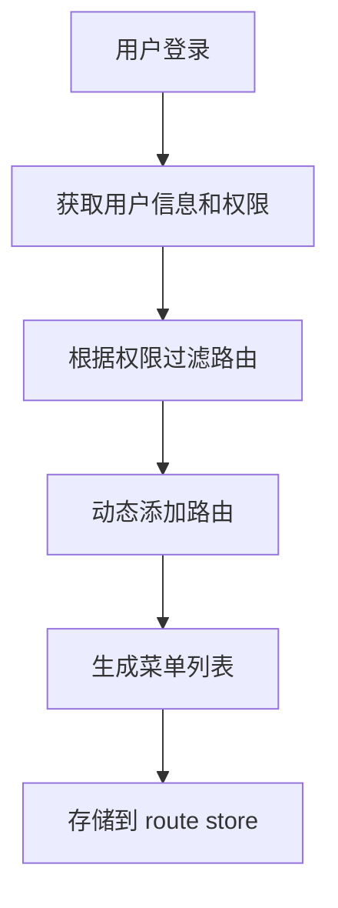

# 设计文档 - 项目基础架构搭建

## 概述

本设计文档描述了 RuoYi-Plus-Soybean 前端项目的基础架构实现方案。该架构基于 Vue 3 + TypeScript + Vite + Pinia + Vue Router 技术栈，提供了一套完整的企业级前端应用基础设施，包括项目结构、HTTP 客户端、路由系统、状态管理、工具函数库等核心模块。

### 设计目标

1. **模块化设计**：清晰的目录结构和模块划分，便于代码组织和维护
2. **类型安全**：完整的 TypeScript 类型定义，提供良好的开发体验
3. **可扩展性**：灵活的架构设计，支持功能扩展和定制
4. **开发效率**：统一的工具函数和配置，减少重复代码
5. **错误处理**：完善的错误处理机制，提供友好的用户体验

## 架构设计

### 整体架构

系统采用分层架构设计，从下到上分为以下几层：

```
┌─────────────────────────────────────────┐
│           视图层 (Views/Components)       │
├─────────────────────────────────────────┤
│           状态管理层 (Pinia Stores)       │
├─────────────────────────────────────────┤
│           服务层 (API Services)          │
├─────────────────────────────────────────┤
│           HTTP 客户端层 (Axios)          │
├─────────────────────────────────────────┤
│           工具层 (Utils/Constants)       │
└─────────────────────────────────────────┘
```

### 目录结构设计


```
src/
├── assets/              # 静态资源
│   ├── images/         # 图片资源
│   ├── styles/         # 全局样式
│   └── fonts/          # 字体文件
├── components/          # 可复用组件
│   ├── common/         # 通用组件
│   └── business/       # 业务组件
├── views/              # 页面组件
├── layouts/            # 布局组件
│   ├── default/        # 默认布局
│   └── blank/          # 空白布局
├── router/             # 路由配置
│   ├── index.ts        # 路由实例
│   ├── routes.ts       # 路由定义
│   └── guards.ts       # 路由守卫
├── stores/             # Pinia 状态管理
│   ├── modules/        # 状态模块
│   │   ├── auth.ts     # 认证状态
│   │   ├── app.ts      # 应用状态
│   │   ├── route.ts    # 路由状态
│   │   └── tab.ts      # 标签页状态
│   └── index.ts        # Store 入口
├── service/            # API 服务层
│   ├── api/            # API 接口定义
│   │   ├── auth.ts     # 认证接口
│   │   └── ...         # 其他接口
│   └── request.ts      # HTTP 客户端
├── utils/              # 工具函数
│   ├── storage.ts      # 本地存储
│   ├── auth.ts         # 认证工具
│   ├── common.ts       # 通用工具
│   └── validate.ts     # 验证工具
├── hooks/              # Vue 组合函数
├── typings/            # TypeScript 类型定义
│   ├── api.d.ts        # API 类型
│   ├── global.d.ts     # 全局类型
│   └── router.d.ts     # 路由类型
├── constants/          # 常量定义
│   ├── index.ts        # 通用常量
│   └── status.ts       # 状态码常量
├── directives/         # 自定义指令
├── plugins/            # 插件配置
├── config/             # 配置文件
│   └── index.ts        # 环境配置
└── main.ts             # 应用入口
```

## 组件和接口设计

### 1. HTTP 客户端模块

#### 接口设计

```typescript
// service/request.ts

interface RequestConfig extends AxiosRequestConfig {
  skipErrorHandler?: boolean;  // 跳过统一错误处理
  skipAuth?: boolean;           // 跳过认证
}

interface ResponseData<T = any> {
  code: number;
  msg: string;
  data: T;
}

class HttpClient {
  private instance: AxiosInstance;
  
  constructor(config?: AxiosRequestConfig);
  request<T>(config: RequestConfig): Promise<T>;
  get<T>(url: string, config?: RequestConfig): Promise<T>;
  post<T>(url: string, data?: any, config?: RequestConfig): Promise<T>;
  put<T>(url: string, data?: any, config?: RequestConfig): Promise<T>;
  delete<T>(url: string, config?: RequestConfig): Promise<T>;
}
```


#### 实现细节

**请求拦截器**：
- 添加 Authorization 请求头（从 localStorage 读取 token）
- 添加 Content-Type 请求头
- 添加请求时间戳（防止缓存）

**响应拦截器**：
- 提取响应数据（返回 data 字段）
- 处理业务错误码（code !== 200）
- 处理 HTTP 错误状态码（401、403、500 等）
- 显示错误提示信息

**错误处理策略**：
- 401 未授权：清除 token，跳转登录页
- 403 禁止访问：显示权限不足提示
- 500 服务器错误：显示服务器错误提示
- 网络错误：显示网络连接失败提示
- 超时错误：显示请求超时提示

### 2. 路由系统模块

#### 路由配置接口

```typescript
// typings/router.d.ts

interface RouteMeta {
  title?: string;           // 页面标题
  icon?: string;            // 菜单图标
  requiresAuth?: boolean;   // 是否需要认证
  permissions?: string[];   // 所需权限
  keepAlive?: boolean;      // 是否缓存
  hidden?: boolean;         // 是否隐藏菜单
  affix?: boolean;          // 是否固定标签页
}

interface RouteConfig {
  path: string;
  name?: string;
  component?: Component;
  redirect?: string;
  meta?: RouteMeta;
  children?: RouteConfig[];
}
```

#### 路由守卫设计

```typescript
// router/guards.ts

// 全局前置守卫
router.beforeEach(async (to, from, next) => {
  // 1. 显示加载进度条
  // 2. 检查路由是否需要认证
  // 3. 检查用户登录状态
  // 4. 检查用户权限
  // 5. 动态加载路由（首次登录）
  // 6. 设置页面标题
});

// 全局后置守卫
router.afterEach(() => {
  // 隐藏加载进度条
});
```

#### 动态路由加载流程



### 3. 状态管理模块

#### Auth Store 设计

```typescript
// stores/modules/auth.ts

interface AuthState {
  token: string;
  userInfo: UserInfo | null;
  permissions: string[];
  roles: string[];
}

interface AuthStore {
  // 状态
  token: string;
  userInfo: UserInfo | null;
  permissions: string[];
  roles: string[];
  
  // Getters
  isLoggedIn: boolean;
  hasPermission: (permission: string) => boolean;
  hasRole: (role: string) => boolean;
  
  // Actions
  login: (credentials: LoginParams) => Promise<void>;
  logout: () => Promise<void>;
  getUserInfo: () => Promise<void>;
  resetToken: () => void;
}
```


#### App Store 设计

```typescript
// stores/modules/app.ts

interface AppState {
  sidebarCollapsed: boolean;  // 侧边栏折叠状态
  device: 'mobile' | 'desktop';  // 设备类型
  theme: 'light' | 'dark';    // 主题
}

interface AppStore {
  sidebarCollapsed: boolean;
  device: 'mobile' | 'desktop';
  theme: 'light' | 'dark';
  
  toggleSidebar: () => void;
  setDevice: (device: 'mobile' | 'desktop') => void;
  setTheme: (theme: 'light' | 'dark') => void;
}
```

#### Route Store 设计

```typescript
// stores/modules/route.ts

interface RouteState {
  routes: RouteConfig[];      // 所有路由
  menuList: RouteConfig[];    // 菜单列表
  isRoutesLoaded: boolean;    // 路由是否已加载
}

interface RouteStore {
  routes: RouteConfig[];
  menuList: RouteConfig[];
  isRoutesLoaded: boolean;
  
  setRoutes: (routes: RouteConfig[]) => void;
  generateRoutes: (permissions: string[]) => Promise<RouteConfig[]>;
  resetRoutes: () => void;
}
```

#### Tab Store 设计

```typescript
// stores/modules/tab.ts

interface TabItem {
  path: string;
  name: string;
  title: string;
  affix?: boolean;  // 是否固定
}

interface TabStore {
  tabs: TabItem[];
  activeTab: string;
  
  addTab: (tab: TabItem) => void;
  removeTab: (path: string) => void;
  removeOtherTabs: (path: string) => void;
  removeAllTabs: () => void;
  setActiveTab: (path: string) => void;
}
```

### 4. 工具函数模块

#### Storage 工具

```typescript
// utils/storage.ts

interface StorageOptions {
  encrypt?: boolean;  // 是否加密
  expire?: number;    // 过期时间（秒）
}

class Storage {
  setItem(key: string, value: any, options?: StorageOptions): void;
  getItem<T>(key: string): T | null;
  removeItem(key: string): void;
  clear(): void;
}

// 导出实例
export const localStorage = new Storage('localStorage');
export const sessionStorage = new Storage('sessionStorage');
```

#### Auth 工具

```typescript
// utils/auth.ts

const TOKEN_KEY = 'ACCESS_TOKEN';

export function getToken(): string | null;
export function setToken(token: string): void;
export function removeToken(): void;
export function encryptToken(token: string): string;
export function decryptToken(encryptedToken: string): string;
```

#### Validate 工具

```typescript
// utils/validate.ts

export function isEmail(value: string): boolean;
export function isPhone(value: string): boolean;
export function isUrl(value: string): boolean;
export function isIdCard(value: string): boolean;
export function isPassword(value: string): boolean;
```


## 数据模型

### API 响应模型

```typescript
// typings/api.d.ts

// 基础响应
interface ApiResponse<T = any> {
  code: number;
  msg: string;
  data: T;
}

// 分页响应
interface PageResponse<T = any> {
  rows: T[];
  total: number;
}

// 分页查询参数
interface PageQuery {
  pageNum: number;
  pageSize: number;
  orderByColumn?: string;
  isAsc?: 'asc' | 'desc';
}

// 用户信息
interface UserInfo {
  userId: number;
  userName: string;
  nickName: string;
  email: string;
  phonenumber: string;
  sex: string;
  avatar: string;
  roles: string[];
  permissions: string[];
}

// 登录参数
interface LoginParams {
  username: string;
  password: string;
  code?: string;
  uuid?: string;
}

// 登录响应
interface LoginResponse {
  token: string;
}
```

### 路由数据模型

```typescript
// typings/router.d.ts

interface RouteMetaData {
  title: string;
  icon?: string;
  requiresAuth: boolean;
  permissions?: string[];
  keepAlive: boolean;
  hidden: boolean;
  affix: boolean;
  order?: number;
}

interface RouteRecordData {
  path: string;
  name: string;
  component: string | Component;
  redirect?: string;
  meta: RouteMetaData;
  children?: RouteRecordData[];
}
```

### Store 数据模型

```typescript
// typings/store.d.ts

interface AuthStateData {
  token: string;
  userInfo: UserInfo | null;
  permissions: string[];
  roles: string[];
}

interface AppStateData {
  sidebarCollapsed: boolean;
  device: 'mobile' | 'desktop';
  theme: 'light' | 'dark';
}

interface RouteStateData {
  routes: RouteRecordData[];
  menuList: RouteRecordData[];
  isRoutesLoaded: boolean;
}

interface TabStateData {
  tabs: TabItem[];
  activeTab: string;
}
```


## 正确性属性

正确性属性是系统应该满足的特征或行为，这些属性在所有有效执行中都应该成立。属性是人类可读规范和机器可验证正确性保证之间的桥梁。

### 属性 1: HTTP 请求头注入一致性

*对于任意* HTTP 请求，当存在有效的 Token 时，请求头中应该包含 Authorization 字段，且其值应该为 "Bearer {token}" 格式。

**验证需求: 3.2**

### 属性 2: HTTP 响应数据提取一致性

*对于任意* 符合 ApiResponse 格式的 HTTP 响应，HTTP 客户端应该提取 data 字段并返回，而不是返回整个响应对象。

**验证需求: 3.4**

### 属性 3: 网络错误处理完整性

*对于任意* 导致网络错误的 HTTP 请求（超时、连接失败等），HTTP 客户端应该捕获错误并返回包含友好错误信息的 rejected Promise。

**验证需求: 3.8**

### 属性 4: 环境配置完整性

*对于任意* 环境配置对象，它应该包含所有必需的配置项（VITE_APP_TITLE、VITE_API_BASE_URL、VITE_API_PREFIX、VITE_UPLOAD_URL）。

**验证需求: 2.3**

### 属性 5: 路由认证守卫一致性

*对于任意* 标记为需要认证的路由（requiresAuth: true），当用户未登录时访问该路由，路由守卫应该阻止导航并重定向到登录页面。

**验证需求: 5.4**

### 属性 6: 路由权限过滤正确性

*对于任意* 路由配置列表和权限列表，动态路由生成函数应该只返回用户有权限访问的路由（路由的 permissions 字段为空或与用户权限有交集）。

**验证需求: 5.6**

### 属性 7: Store 状态持久化往返一致性

*对于任意* Store 状态对象，将其持久化到 localStorage 后再读取，应该得到与原始状态等价的对象。

**验证需求: 6.5**

### 属性 8: Token 加密存储往返一致性

*对于任意* Token 字符串，经过加密存储到 localStorage 后再读取并解密，应该得到与原始 Token 相同的字符串。

**验证需求: 7.4**

### 属性 9: Storage 工具往返一致性

*对于任意* 可序列化的数据对象，使用 Storage 工具的 setItem 存储后再使用 getItem 读取，应该得到与原始数据等价的对象。

**验证需求: 7.2**


## 错误处理

### HTTP 客户端错误处理

#### 网络错误
- **超时错误**: 显示"请求超时，请稍后重试"
- **连接失败**: 显示"网络连接失败，请检查网络设置"
- **请求取消**: 静默处理，不显示错误提示

#### HTTP 状态码错误
- **400 Bad Request**: 显示服务器返回的错误消息
- **401 Unauthorized**: 清除 token，跳转登录页，显示"登录已过期，请重新登录"
- **403 Forbidden**: 显示"权限不足，无法访问该资源"
- **404 Not Found**: 显示"请求的资源不存在"
- **500 Internal Server Error**: 显示"服务器内部错误，请稍后重试"
- **502/503/504**: 显示"服务暂时不可用，请稍后重试"

#### 业务错误码处理
- **code !== 200**: 显示服务器返回的 msg 字段内容
- **特殊业务码**: 根据具体业务需求进行特殊处理

### 路由错误处理

#### 路由守卫错误
- **未登录访问受保护路由**: 重定向到登录页，保存原始目标路由
- **无权限访问路由**: 重定向到 403 页面
- **路由不存在**: 重定向到 404 页面

#### 动态路由加载错误
- **获取用户信息失败**: 清除 token，跳转登录页
- **路由配置错误**: 记录错误日志，使用默认路由配置

### Store 错误处理

#### 状态持久化错误
- **localStorage 不可用**: 降级为内存存储，显示警告
- **存储空间不足**: 清理过期数据，显示提示
- **数据解析错误**: 清除损坏的数据，使用默认值

#### 异步操作错误
- **登录失败**: 显示错误消息，保持在登录页
- **获取用户信息失败**: 清除 token，跳转登录页
- **登出失败**: 强制清除本地数据，跳转登录页

### 工具函数错误处理

#### Storage 工具错误
- **存储失败**: 返回 false，记录错误日志
- **读取失败**: 返回 null，记录错误日志
- **加密/解密失败**: 抛出错误，由调用方处理

#### 验证工具错误
- **无效输入**: 返回 false
- **正则表达式错误**: 记录错误，返回 false

## 测试策略

### 测试方法

本项目采用**双重测试方法**，结合单元测试和基于属性的测试，以确保全面覆盖：

1. **单元测试**: 验证特定示例、边缘情况和错误条件
2. **基于属性的测试**: 验证跨所有输入的通用属性

这两种测试方法是互补的，都是实现全面覆盖所必需的。单元测试捕获具体的错误，而基于属性的测试验证一般正确性。

### 测试框架

- **单元测试框架**: Vitest
- **基于属性的测试库**: fast-check
- **测试覆盖率工具**: Vitest Coverage (c8)

### 基于属性的测试配置

- 每个属性测试必须运行**至少 100 次迭代**（由于随机化）
- 每个属性测试必须使用注释标签引用其设计文档属性
- 标签格式: `// Feature: project-infrastructure, Property {number}: {property_text}`
- 每个正确性属性必须由**单个**基于属性的测试实现

### 测试覆盖范围

#### HTTP 客户端测试

**单元测试**:
- 基本请求方法（GET、POST、PUT、DELETE）
- 请求拦截器功能
- 响应拦截器功能
- 特定错误状态码处理（401、403、500）
- 请求取消功能
- 超时配置

**基于属性的测试**:
- 属性 1: HTTP 请求头注入一致性
- 属性 2: HTTP 响应数据提取一致性
- 属性 3: 网络错误处理完整性

#### 路由系统测试

**单元测试**:
- 路由配置正确性
- 路由懒加载功能
- 公共路由存在性
- 路由元信息配置
- 未登录访问受保护路由（边缘情况）

**基于属性的测试**:
- 属性 5: 路由认证守卫一致性
- 属性 6: 路由权限过滤正确性

#### 状态管理测试

**单元测试**:
- Store 模块存在性
- 状态结构正确性
- 操作方法功能
- Auth Store 登录/登出流程
- App Store 状态切换
- Route Store 路由管理
- Tab Store 标签页管理

**基于属性的测试**:
- 属性 7: Store 状态持久化往返一致性

#### 工具函数测试

**单元测试**:
- Storage 工具基本操作
- Auth 工具 Token 管理
- Validate 工具验证规则
- 边缘情况（空值、特殊字符等）

**基于属性的测试**:
- 属性 8: Token 加密存储往返一致性
- 属性 9: Storage 工具往返一致性

#### 配置和常量测试

**单元测试**:
- 环境配置文件存在性
- 配置项完整性
- 常量定义正确性
- Vite 配置选项

**基于属性的测试**:
- 属性 4: 环境配置完整性

### 测试示例

#### 基于属性的测试示例

```typescript
// Feature: project-infrastructure, Property 1: HTTP 请求头注入一致性
import fc from 'fast-check';
import { describe, it, expect } from 'vitest';

describe('HTTP Client - Request Header Injection', () => {
  it('should inject Authorization header when token exists', () => {
    fc.assert(
      fc.property(
        fc.string({ minLength: 10 }), // 生成随机 token
        fc.webUrl(), // 生成随机 URL
        (token, url) => {
          // 设置 token
          setToken(token);
          
          // 创建请求配置
          const config = httpClient.getRequestConfig({ url, method: 'GET' });
          
          // 验证 Authorization 头存在且格式正确
          expect(config.headers.Authorization).toBe(`Bearer ${token}`);
        }
      ),
      { numRuns: 100 }
    );
  });
});
```

#### 单元测试示例

```typescript
import { describe, it, expect, beforeEach } from 'vitest';

describe('HTTP Client - Error Handling', () => {
  it('should redirect to login page on 401 error', async () => {
    // 模拟 401 响应
    mockAxios.onGet('/api/test').reply(401);
    
    // 发送请求
    await expect(httpClient.get('/api/test')).rejects.toThrow();
    
    // 验证 token 已清除
    expect(getToken()).toBeNull();
    
    // 验证已重定向到登录页
    expect(router.currentRoute.value.path).toBe('/login');
  });
});
```

### 持续集成

- 所有测试必须在 CI/CD 流程中自动运行
- 代码覆盖率目标: 80% 以上
- 所有基于属性的测试必须通过才能合并代码
- 失败的测试必须记录反例并修复

